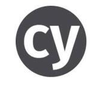
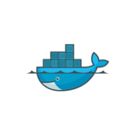
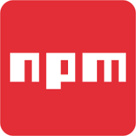

# Get to production!

Matthew Worthington

Note:

- Developer @ ThoughtWorks
- Twitter: worthington10

---

## What is a CI/CD pipeline?

- Initiates code builds
- Runs automated tests
- Deploys your code

Note:

- Automate the software delivery process
- One change, One artefact
- Promoted through a single pipeline, deployed to many environments
- -
- Details
- A CI/CD pipeline helps you automate steps in your software delivery process
- One artefact, promoted through a single pipeline, deployed to many environments
  
---

## Why do we use them?

- Reduce cost of deployment
- Remove manual errors
- Provide standardized feedback loops
- Enable fast product iterations.

Note: 

- Through automation
- Leading to risk reduction, increasing delivery confidence

---

## Risk reduction

- Low-risk releases are incremental
- Decouple deployment and release
- Focus on reducing batch size
- Optimize for resilience

Note:

- Independently releasable changes
  - tight coupling == big-bang risky releases.
- Technical decision to deploy != the business decision
  - Continously deploy + Dark releases and feature toggles
- 10s of lines of code == easier root cause analysis + service restoration
- Failures are inevitable, rapid service restoration
- -
- Details
- Architect our systems so that we can release individual changes independently, tight coupling will lead to big-bang risky releases.
- Separate the technical decision to deploy from the business decision to launch a feature, so we can deploy continuously but release new features on demand. Two commonly-used patterns that enable this goal are dark launching and feature toggles.
- When each deployment consists of tens of lines of code or a few configuration settings, it becomes much easier to perform root cause analysis and restore service in the case of an incident.
- Failures are inevitable, how do we restore service as rapidly as possible when something goes wrong -->

---

## Best practice

- Only build packages once
- Deploy the same way to every environment
- Smoke test your deployments
- Keep your environments similar

Note:

- Same thing we’ve tested throughout the deployment pipeline
  - eliminating the packages as the source of the failure
- We test the deployment process many times before it gets to production
- Running and available as part of the deployment process.
- Same version of the operating system and middleware packages
- -
- Details
- We want to be sure the thing we’re deploying is the same thing we’ve tested throughout the deployment pipeline, eliminating the packages as the source of the failure.
- We test the deployment process many, many times before it gets to production,eliminating it as the source of any problems.
- Make sure your application is running and available as part of the deployment process.
- Keep your environments similar. Same version of the operating system and middleware packages, configured in the same way. This has become much easier to achieve with modern virtualization, container technology and infrastructure as code.

---

## Triggers

- Code commit
- Scheduled/ CRON
- Manual
  
Note:

- Details
- Each change in code triggers an automated build-and-test sequence for the given project, providing feedback to the engineering team
- You may want to run tests constantly over a period or perform cleanup tasks
- In some situations a manual triggered pipeline or stage may be necessary, you may require sign-off from QA or have set release dates

---

## ‘You build it, you run it’ 

@snapend

@fa[rocket fa-5x fa-spin]

---

## 1. Build

---

## 2. Code quality gate

---

## 3. Test automation

---

## 4. Publish

---

## 5. Deploy to staging

---

## 6. Smoke tests

---

## 7. Manual approval

---

## 8. Deplpy to prod

---

## TADA!

---

## What will we be using?

---

## What accounts will I need?

---

## Lets get going

[https://github.com/worthington10TW/hello-karta](https://github.com/worthington10TW/hello-karta)
